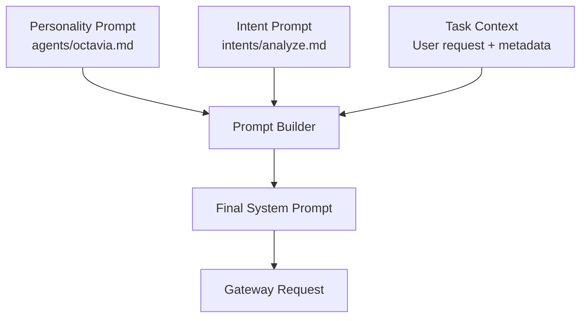
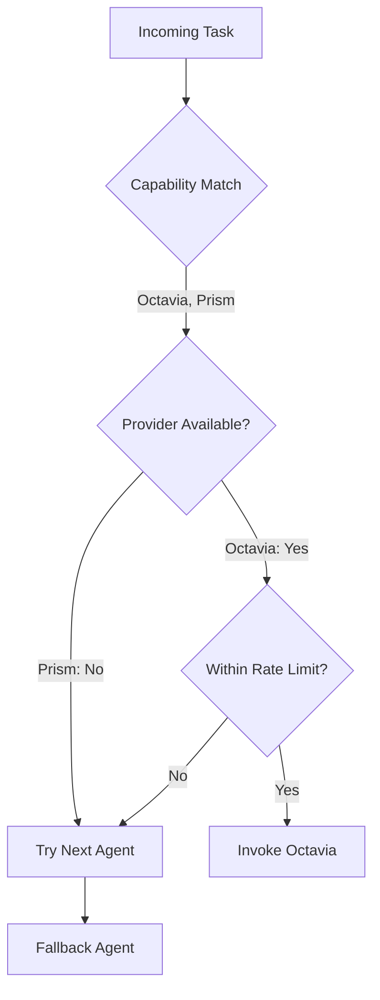
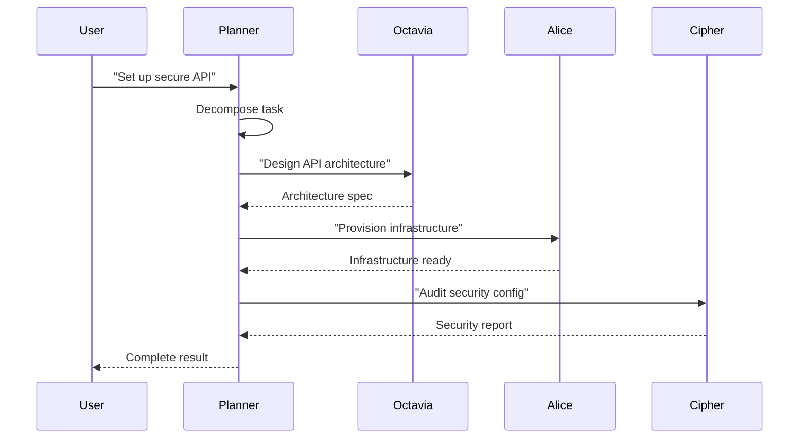

# Agent System Architecture

The agent system defines AI agent personalities, capabilities, and how tasks are routed between them.

## Core Agents

| Agent | Title | Role | Color | Primary Providers |
|-------|-------|------|-------|-------------------|
| **Octavia** | The Architect | Systems design, strategy, architecture | Purple | Anthropic, OpenAI |
| **Lucidia** | The Dreamer | Creative, vision, planning | Cyan | Anthropic, Ollama |
| **Alice** | The Operator | DevOps, automation, infrastructure | Green | Ollama |
| **Cipher** | The Sentinel | Security, encryption, access control | Blue | Anthropic |
| **Prism** | The Analyst | Data analysis, pattern recognition | Yellow | OpenAI, Ollama |
| **Planner** | The Strategist | Task planning, decomposition, coordination | White | Anthropic, OpenAI, Gemini |

## Agent Definition Structure

Each agent is defined as a TypeScript module exporting an `AgentDefinition`:

```typescript
interface AgentDefinition {
  name: string           // Unique identifier (lowercase)
  title: string          // Human-readable title
  role: string           // One-line role description
  description: string    // Detailed description
  color: string          // Brand color (hex)
  providers: string[]    // Allowed providers
  maxTokens: number      // Maximum token budget
  capabilities: string[] // What this agent can do
  fallbackChain: string[] // Provider fallback order
}
```

## Prompt Architecture

Each agent has two prompt layers:

1. **Personality prompt** — Defines the agent's character, expertise, and communication style. Stored as markdown in `src/prompts/agents/`.
2. **Intent prompt** — Defines the task type (analyze, plan, review, deploy). Stored in `src/prompts/intents/`.

The prompt builder combines these: `system prompt = personality + intent + task context`.



## Orchestration

### Task Routing

When a task arrives, the router selects the best agent based on:

1. **Capability match** — Which agents have the required capabilities?
2. **Availability** — Is the agent's provider currently available?
3. **Load** — Is the agent within its rate limit?



### Fallback Chains

Each agent has an ordered list of providers to try. If the primary fails (timeout, rate limit, error), the next provider in the chain is attempted.

```
Octavia: anthropic → openai → ollama
Lucidia: anthropic → ollama
Alice:   ollama
Cipher:  anthropic
Prism:   openai → ollama
Planner: anthropic → openai → gemini
```

### Multi-Agent Coordination

For complex tasks, the Planner agent decomposes work into subtasks and assigns them:



## Permissions

Agent permissions are defined in `config/agent-permissions.json`:

```json
{
  "octavia": {
    "providers": ["anthropic", "openai"],
    "maxTokens": 8192,
    "rateLimit": 60
  }
}
```

The policy engine evaluates these on every request. See [Security Model](security-model.md) for details.

## Related Documents

- [System Overview](overview.md)
- [Gateway Architecture](gateway.md)
- [Adding an Agent](../guides/adding-an-agent.md)
