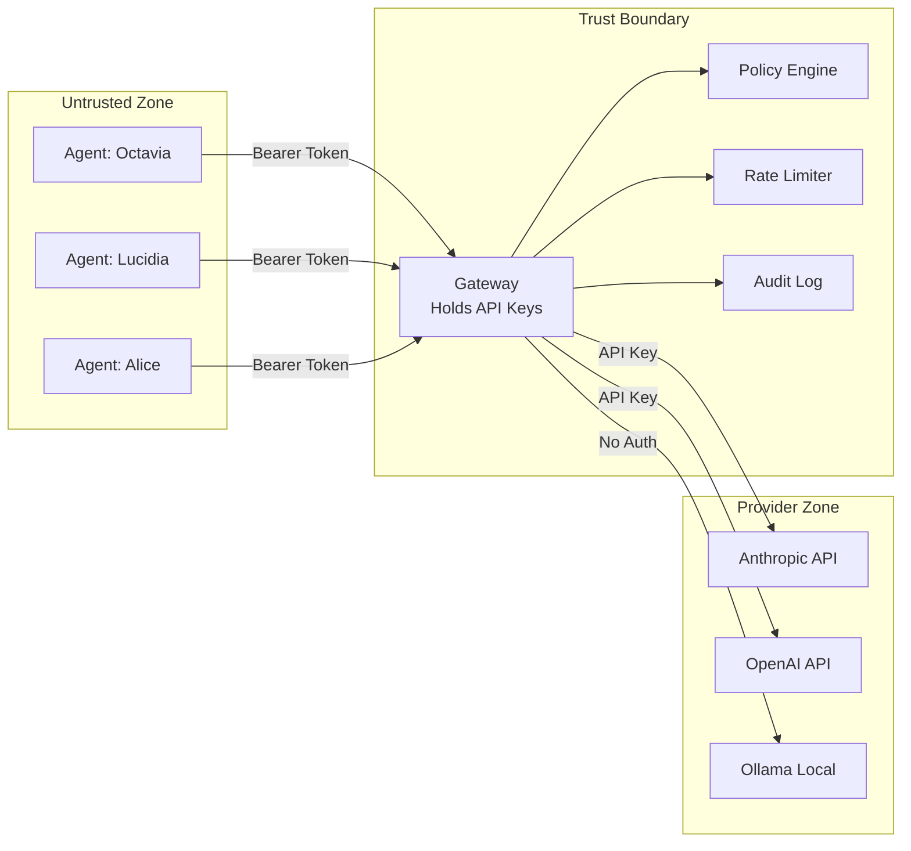
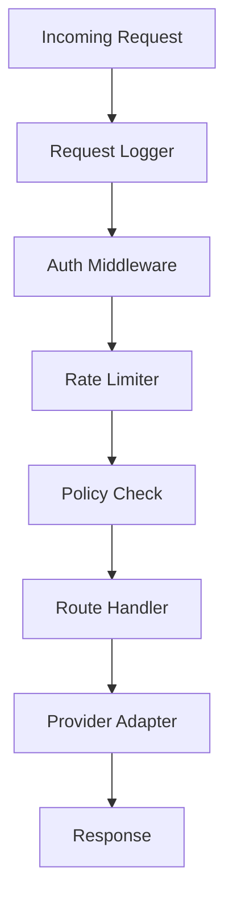

# Gateway Architecture

The BlackRoad Gateway is the central trust boundary. It holds all provider API keys and mediates every request between agents and AI providers.

## Tokenless Design

Agents never hold API keys. This is the foundational security principle.



## Request Flow

1. Agent sends request with its Bearer token (identifies the agent, NOT a provider key)
2. Gateway validates the token and extracts agent identity
3. Policy engine checks if the agent is allowed to perform the requested action
4. Rate limiter checks if the agent is within its quota
5. Gateway selects the appropriate provider based on agent config and availability
6. Gateway forwards the request to the provider, injecting the provider API key
7. Response is received, sanitized, and returned to the agent
8. Request is logged to the audit trail

## Middleware Stack



| Middleware | Purpose |
|-----------|---------|
| Request Logger | Structured logging of every request (method, path, agent, duration) |
| Auth | Validates Bearer token, extracts agent identity |
| Rate Limiter | Token bucket algorithm, per-agent limits |
| Policy Check | Evaluates agent permissions against the requested action |

## Provider Adapters

Each provider adapter implements a common interface:

```typescript
interface Provider {
  name: string
  chat(request: ChatRequest): Promise<ChatResponse>
  isAvailable(): Promise<boolean>
}
```

Adapters handle provider-specific request/response translation. The gateway sees a unified interface.

| Provider | Base URL | Auth Method |
|----------|----------|-------------|
| Anthropic | `https://api.anthropic.com` | `x-api-key` header |
| OpenAI | `https://api.openai.com` | `Authorization: Bearer` |
| Ollama | `http://localhost:11434` | None (local) |
| Gemini | `https://generativelanguage.googleapis.com` | API key parameter |

## Configuration

Gateway configuration is loaded from `config/default.json` with environment variable overrides:

- `BLACKROAD_GATEWAY_PORT` — Server port (default: 8787)
- `BLACKROAD_GATEWAY_HOST` — Bind address (default: 127.0.0.1)
- `BLACKROAD_ANTHROPIC_API_KEY` — Anthropic provider key
- `BLACKROAD_OPENAI_API_KEY` — OpenAI provider key
- `BLACKROAD_OLLAMA_URL` — Ollama endpoint URL

## Error Handling

The gateway returns structured errors with consistent codes. See [error codes](../api/error-codes.md) for the full reference.

## Related Documents

- [System Overview](overview.md)
- [Security Model](security-model.md)
- [Gateway API](../api/gateway-api.md)
