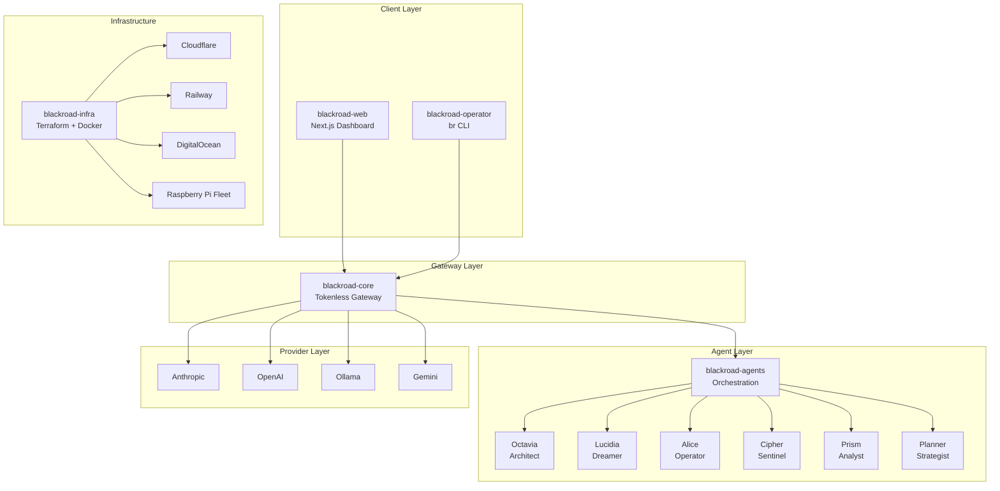
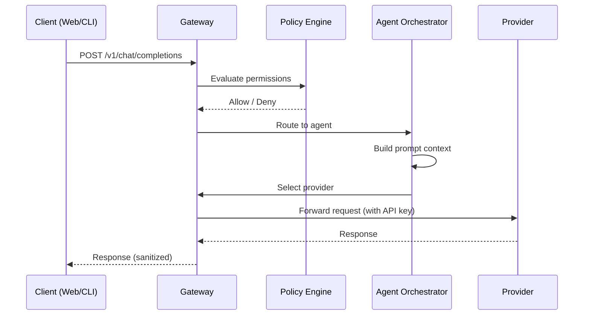

# System Overview

BlackRoad OS is a distributed AI infrastructure platform. This document describes the high-level architecture and how components interact.

## Component Map

## Repositories

| Repository | Purpose | Stack |
|------------|---------|-------|
| `blackroad-core` | Gateway + runtime engine | TypeScript, Hono, Zod |
| `blackroad-agents` | Agent definitions + orchestration | TypeScript, Zod, Commander |
| `blackroad-web` | Frontend dashboard | Next.js 15, React 19, Tailwind |
| `blackroad-operator` | CLI tooling (`br` command) | TypeScript, Commander, Chalk |
| `blackroad-infra` | IaC + CI/CD + containers | Terraform, Docker, GitHub Actions |
| `blackroad-docs` | Documentation (this repo) | Markdown, Mermaid |

## Core Principles

1. **Tokenless agents** — No agent ever holds an API key. All provider communication flows through the gateway.
2. **Policy-driven access** — Agent permissions are defined declaratively in JSON. The policy engine evaluates every request.
3. **Provider agnostic** — Agents request capabilities, not specific providers. The gateway routes to the best available provider.
4. **Fallback chains** — Every agent has an ordered list of providers. If one fails, the next is tried automatically.
5. **Observable** — Every request is logged, metered, and traceable.

## Data Flow

## Network Topology

All services communicate over HTTPS. The gateway binds to localhost by default and is exposed through Cloudflare Tunnel or direct deployment. See [networking documentation](../guides/local-development.md) for local setup.

## Related Documents

- [Gateway Architecture](gateway.md)
- [Agent System](agent-system.md)
- [Security Model](security-model.md)
