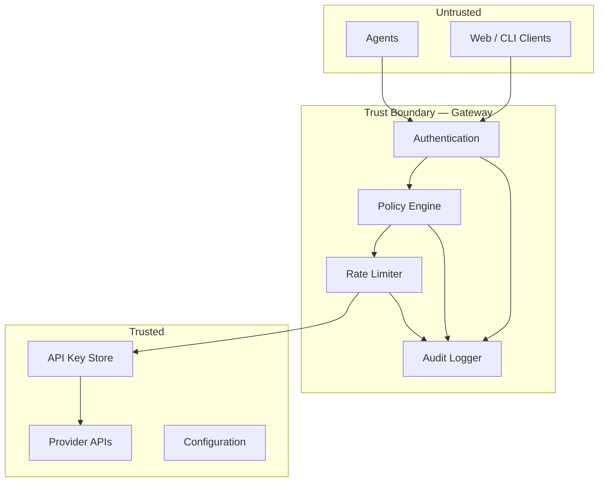

# Security Model

Security architecture for BlackRoad OS. The system is designed around the principle that agents are untrusted and all sensitive operations are mediated by the gateway.

## Threat Model

| Threat | Mitigation |
|--------|-----------|
| Agent exfiltrates API keys | Tokenless design — agents never see provider keys |
| Unauthorized provider access | Policy engine evaluates every request |
| Denial of service | Per-agent rate limiting with token bucket |
| Prompt injection | Input validation and output sanitization |
| Audit trail tampering | Append-only structured logging |
| Key compromise | Automated key rotation with zero-downtime |

## Trust Boundaries



## Policy Engine

The policy engine is a declarative access control system. Policies are defined in JSON:

```json
{
  "agents": {
    "octavia": {
      "providers": ["anthropic", "openai"],
      "maxTokens": 8192,
      "rateLimit": 60,
      "capabilities": ["architecture", "design", "review"]
    }
  }
}
```

Every gateway request passes through the engine. The evaluation flow:

1. Extract agent identity from Bearer token
2. Look up agent permissions
3. Check if the requested provider is in the allowlist
4. Check if token count is within budget
5. Check rate limit counter
6. Return `allow`, `deny`, or `escalate`

## Rate Limiting

Token bucket algorithm with per-agent configuration:

- Each agent has a bucket that refills at a configured rate
- Requests consume one token per invocation
- When the bucket is empty, requests are rejected with `429 Too Many Requests`
- Bucket size and refill rate are configurable per agent

## Audit Logging

Every request produces a structured log entry:

```json
{
  "timestamp": "2026-01-15T10:30:00Z",
  "requestId": "req_abc123",
  "agent": "octavia",
  "action": "chat",
  "provider": "anthropic",
  "model": "claude-sonnet-4-20250514",
  "tokens": 1024,
  "duration": 850,
  "status": "success"
}
```

Logs are append-only and written to structured files. They are not modifiable after creation.

## Secret Management

Provider API keys are stored in environment variables on the gateway host. They are never:

- Committed to version control
- Exposed in logs (redacted automatically)
- Sent to agents or clients
- Included in error messages

Key rotation is handled via the [key rotation runbook](../runbooks/key-rotation.md).

## Input Validation

All incoming requests are validated with Zod schemas before processing. Invalid requests are rejected with `400 Bad Request` and a structured error response. See [protocol spec](../api/protocol-spec.md) for schema definitions.

## Related Documents

- [Gateway Architecture](gateway.md)
- [Error Codes](../api/error-codes.md)
- [Key Rotation Runbook](../runbooks/key-rotation.md)
