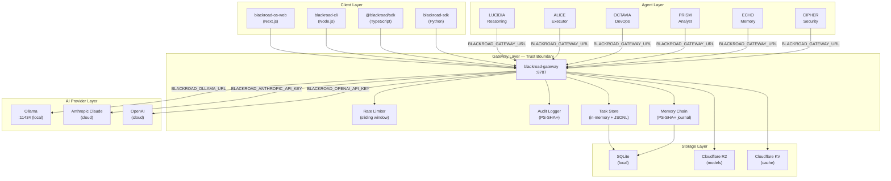
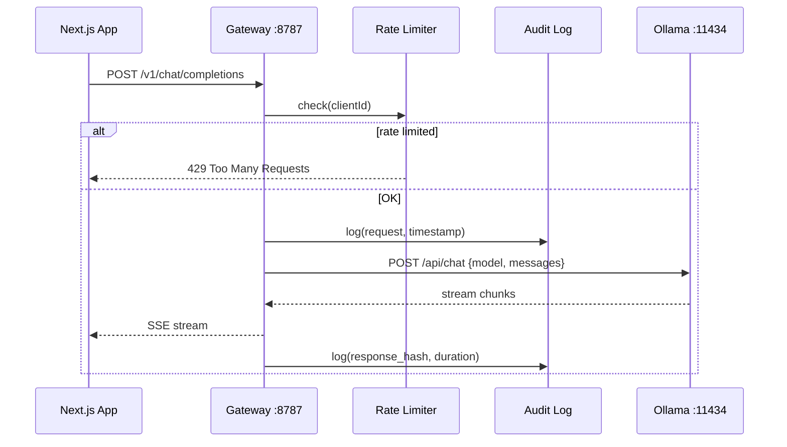

# BlackRoad OS — System Architecture

## Overview

BlackRoad OS is a distributed AI agent platform built on a **tokenless gateway** architecture.
All AI provider communication is centralized at the gateway boundary; agents never hold secrets.

---

## System Diagram



---

## Key Architectural Decisions

### 1. Tokenless Agents
Agents hold **zero credentials**. They authenticate only with the local gateway via `BLACKROAD_GATEWAY_URL`.
The gateway owns all provider API keys in environment variables — never in code.

```
❌ Bad:  agent.call(api_key="sk-...", model="claude-3")
✅ Good: agent.call(gateway_url="http://127.0.0.1:8787", model="claude-3")
```

### 2. PS-SHA∞ Memory Chain
All memory writes create a tamper-evident hash chain. Each entry commits:
```
hash = SHA256(prev_hash : content : timestamp_ns)
```
- Genesis uses `"GENESIS"` as prev_hash
- Erasure = cryptographic quarantine (not deletion): `[ERASED:SHA256(original)]`
- Truth states: `1` = True, `0` = Unknown, `-1` = False (Łukasiewicz trinary logic)

### 3. Locality-First
- Ollama runs **on-device** (Raspberry Pi or local Mac)
- Cloud providers are fallbacks, not defaults
- Gateway binds to `127.0.0.1` by default — no external exposure

### 4. Agent Identity
Each agent has: `name | type | capabilities | system_prompt`
Identity is portable — the same LUCIDIA persona runs on any provider, model, or hardware.

---

## Data Flow: Chat Request



---

## Infrastructure Map

| Layer | Technology | Purpose |
|-------|-----------|---------|
| CDN/Edge | Cloudflare Workers (75+) | Request routing, caching |
| Web | Vercel (15+) | Next.js deployments |
| API | Railway (14 projects) | Service hosting |
| AI Inference | Raspberry Pi (3 nodes) | Local Ollama inference |
| Storage | Cloudflare R2 (135GB) | Model weights |
| Tunnel | Cloudflare Tunnel | Pi → Internet bridge |
| IaC | Terraform + Ansible | Infra as code |
| Orchestration | Nomad / Docker Compose | Agent deployment |

---

## Security Model

```
[Internet] → [Cloudflare WAF] → [Vercel/Railway] → [Gateway :8787 (127.0.0.1)]
                                                            ↕
                                                   [Agents (no keys)]
```

- Gateway binds localhost-only in dev (`BLACKROAD_GATEWAY_BIND=127.0.0.1`)
- All provider keys in `BLACKROAD_*` env vars, injected at runtime
- Vault uses AES-256-CBC, master key at `~/.blackroad/vault/.master.key` (chmod 400)
- Audit log is PS-SHA∞ chain — entries cannot be deleted or backdated
