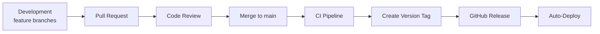

# Release Process

How we version, tag, and deploy BlackRoad OS releases.

## Versioning

All repositories follow [Semantic Versioning](https://semver.org/):

- **MAJOR** (x.0.0) — Breaking API changes
- **MINOR** (0.x.0) — New features, backward compatible
- **PATCH** (0.0.x) — Bug fixes, backward compatible

Current convention: All repos start at `0.1.0` during initial development. The `1.0.0` release marks production readiness.

## Release Flow



## Step-by-Step

### 1. Prepare the Release

1. Ensure `main` branch is clean and CI passes
2. Update `CHANGELOG.md` with release notes
3. Bump version in `package.json`
4. Commit: `chore: bump version to x.y.z`

### 2. Create the Tag

```bash
git tag -a v0.1.0 -m "Release v0.1.0: initial scaffolding"
git push origin v0.1.0
```

### 3. Automated Release

The `release.yml` workflow triggers on version tags (`v*`):

1. Builds the project
2. Runs all tests
3. Creates a GitHub Release with changelog
4. Deploys to the appropriate environment

### 4. Post-Release

1. Verify deployment in staging
2. Promote to production (manual approval for `blackroad-core`)
3. Update documentation if needed
4. Announce in the team channel

## Environments

| Environment | Branch/Tag | Auto-Deploy |
|-------------|-----------|-------------|
| Development | Feature branches | No |
| Staging | `main` | Yes (on merge) |
| Production | `v*` tags | Yes (with approval for core) |

## Hotfix Process

For critical production fixes:

1. Branch from the release tag: `git checkout -b hotfix/description v0.1.0`
2. Fix the issue
3. Create PR to `main`
4. After merge, tag a patch release: `v0.1.1`

## Rollback

If a release causes issues:

1. Deploy the previous version tag
2. Create a hotfix branch from the current tag
3. Never revert the `main` branch — always roll forward
